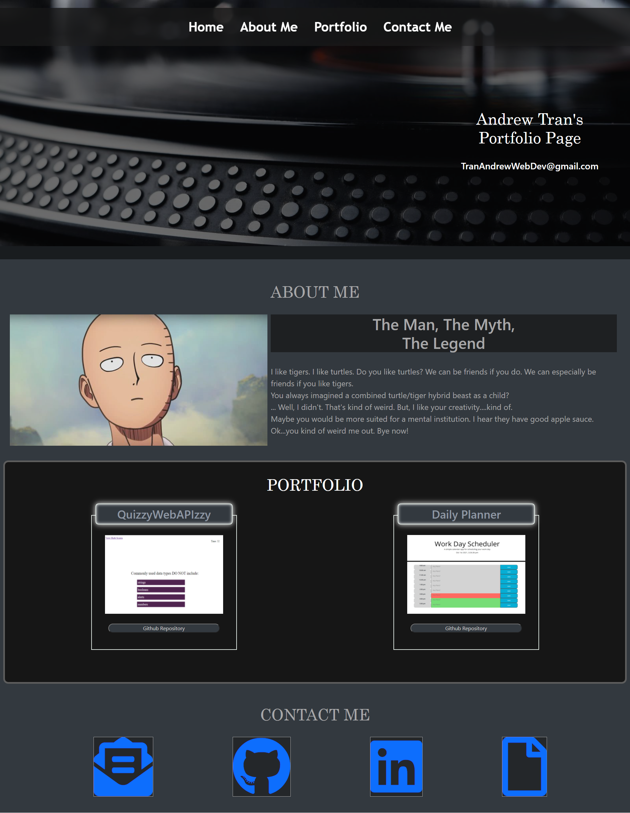

# PortfolioHW2
**Version 1.0**

Portfolio Creation Project

## Task
Students will create their own Portfolio to show case their skills and talents for current and future projects.

**Note** Students currently have 1 project completed thus far.

## Installation Instructions
1. No installation necessary. Click on live webpage. 100% easy.

## Acceptance Criteria
Student's were to create a portfolio that included the following:
* WHEN I load their portfolio
THEN I am presented with the developer's name, a recent photo or avatar, and links to sections about them, their work, and how to contact them
* WHEN I click one of the links in the navigation
THEN the UI scrolls to the corresponding section
* WHEN I click on the link to the section about their work
THEN the UI scrolls to a section with titled images of the developer's applications
* WHEN I am presented with the developer's first application
THEN that application's image should be larger in size than the others
* WHEN I click on the images of the applications
THEN I am taken to that deployed application
* WHEN I resize the page or view the site on various screens and devices
THEN I am presented with a responsive layout that adapts to my viewport

## Screenshot

## Links
* [Deployed Website Link](https://andrewt11.github.io/PortfolioHW2/)

* [Code Repository Link](https://github.com/AndrewT11/PortfolioHW2)

## Credits
Andrew Tran

### Referenced Sources

* https://www.w3schools.com/css/
* https://developer.mozilla.org/en-US/
* https://css-tricks.com/snippets/css/a-guide-to-flexbox/#flexbox-properties
* https://choosealicense.com/
* https://yoksel.github.io/flex-cheatsheet/
* https://www.youtube.com/watch?v=zAVhHHS_IH4&t=56s
* https://www.youtube.com/watch?v=zX3ikOsQg58&t=244s
* https://www.youtube.com/watch?v=YxatgOhNiZA&t=9s

### License
Copyright (c) [2021] [Andrew Tran]

Permission is hereby granted, free of charge, to any person obtaining a copy
of this software and associated documentation files (the "Software"), to deal
in the Software without restriction, including without limitation the rights
to use, copy, modify, merge, publish, distribute, sublicense, and/or sell
copies of the Software, and to permit persons to whom the Software is
furnished to do so, subject to the following conditions:

The above copyright notice and this permission notice shall be included in all
copies or substantial portions of the Software.

THE SOFTWARE IS PROVIDED "AS IS", WITHOUT WARRANTY OF ANY KIND, EXPRESS OR
IMPLIED, INCLUDING BUT NOT LIMITED TO THE WARRANTIES OF MERCHANTABILITY,
FITNESS FOR A PARTICULAR PURPOSE AND NONINFRINGEMENT. IN NO EVENT SHALL THE
AUTHORS OR COPYRIGHT HOLDERS BE LIABLE FOR ANY CLAIM, DAMAGES OR OTHER
LIABILITY, WHETHER IN AN ACTION OF CONTRACT, TORT OR OTHERWISE, ARISING FROM,
OUT OF OR IN CONNECTION WITH THE SOFTWARE OR THE USE OR OTHER DEALINGS IN THE
SOFTWARE.