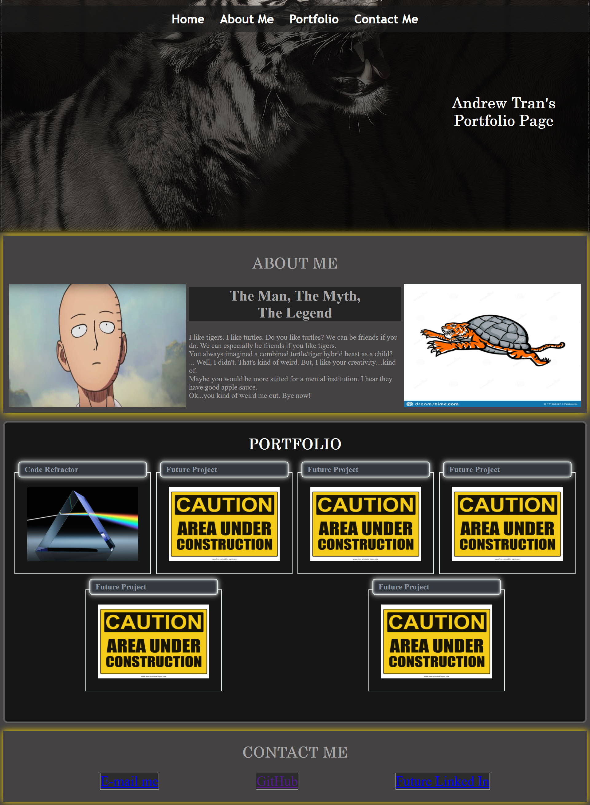

# PortfolioHW2
**Version 1.0**

Portfolio Creation Project

## Task
Students will create their own Portfolio to show case their skills and talents for current and future projects.

**Note** Students currently have 1 project completed thus far.

## Installation
1. No installation necessary. Click on live webpage. 100% easy.

## Acceptance Criteria
Student's were to create a portfolio that included the following:
-WHEN I load their portfolio
THEN I am presented with the developer's name, a recent photo or avatar, and links to sections about them, their work, and how to contact them
-WHEN I click one of the links in the navigation
THEN the UI scrolls to the corresponding section
-WHEN I click on the link to the section about their work
THEN the UI scrolls to a section with titled images of the developer's applications
-WHEN I am presented with the developer's first application
THEN that application's image should be larger in size than the others
-WHEN I click on the images of the applications
THEN I am taken to that deployed application
-WHEN I resize the page or view the site on various screens and devices
THEN I am presented with a responsive layout that adapts to my viewport

## Screenshot

##Links
[Deployed Website Link](https://andrewt11.github.io/PortfolioHW2/)
[Code Repository Link](https://github.com/AndrewT11/PortfolioHW2)

## Credits
Andrew Tran

# Referenced Sources
